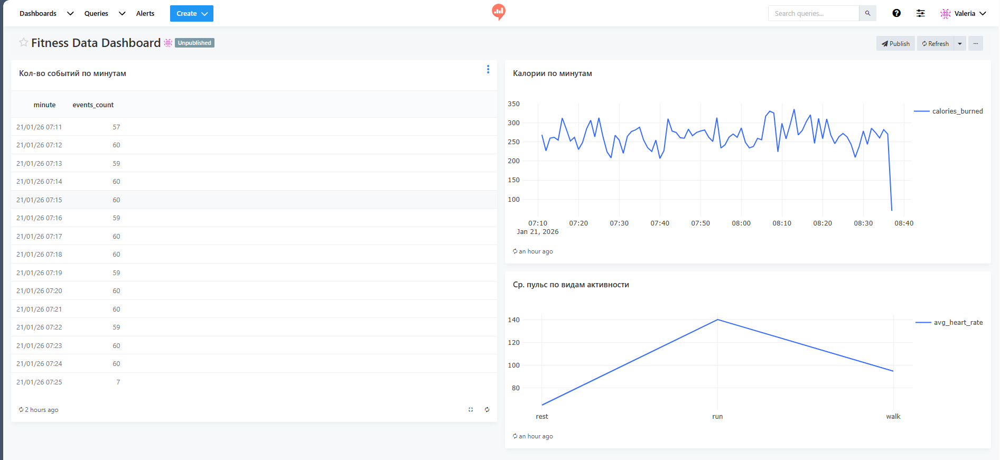

ОПИСАНИЕ ПРОЕКТА

Fitness Data System — это учебная end-to-end система сбора, хранения и анализа фитнес-данных. Система автоматически генерирует данные, сохраняет их в базе данных PostgreSQL и предоставляет инструменты для анализа и визуализации с помощью Redash и Jupyter Notebook.
Проект демонстрирует полный цикл работы с данными: генерация → хранение → аналитика → визуализация.

АРХИТЕКТУРА СИСТЕМЫ
-Data Generator (Python)
Python-скрипт, который периодически (примерно раз в секунду) генерирует фитнес-события и записывает их в базу данных.
-PostgreSQL
Центральное хранилище данных. В базе хранится таблица fitness_events.
-Redash
Используется для выполнения SQL-запросов и построения визуализаций на основе данных из PostgreSQL.
-Jupyter Notebook
Используется для аналитики и исследовательского анализа данных с помощью Python.
-Docker & Docker Compose
Все компоненты запускаются в изолированных контейнерах и связаны между собой через docker-compose.

ДАШБОРД:
Все три визуализации: 
-Средний пульс по видам активности;
-Калории по минутам;
-Количество событий по минутам;
объединены в единый дашборд "Fitness Data Dashboard", который предоставляет общее представление о состоянии данных и активности системы в реальном времени.

(Скриншот дашборда находится в отдельном файле "screenshots")

ЗАПУСК ПРОЕКТА
1. Клонировать репозиторий:

git clone https://github.com/vtalonova-design/fitness-data-system.git
cd fitness-data-system 

2. Запустить сервисы:
docker-compose up --build

3. Доступ к сервисам:
-Redash: http://localhost:5000

-PostgreSQL: localhost:5432

-Jupyter Notebook: http://localhost:8888
 При первом открытии требуется token, который можно получить командой:docker-compose logs jupyter
 В логах будет строка вида:http://127.0.0.1:8888/?token=XXXX
 

